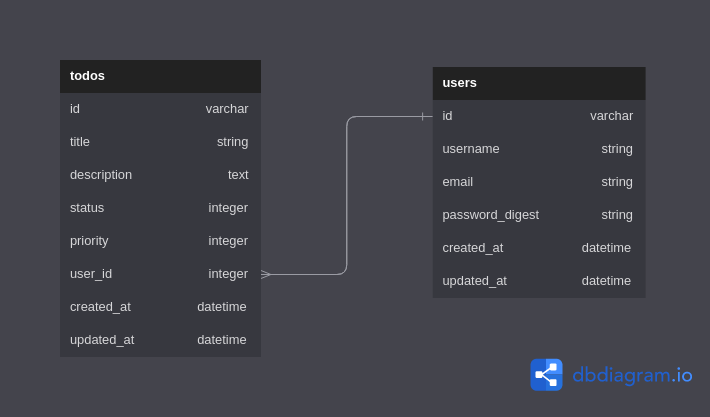

# phase-4-Task-Taker
This is a simple RESTful API for tracking users and their tasks. It is built with Ruby on Rails.

We have two models: User and Task.

## Use this link to access the api and add endpoints to perform requests:
        https://hero-p4fk.onrender.com/heroes

## Models

The following relationships have been established:

- A `User` has many `Tasks`

- A `Task` belongs to a `User`.

## Entity Relationship Diagram(ERD)

## Validations

In `User` model:
- `username` must be more than five and less than eight characters

In `Task` model:
- `description` must be present and at least 20 characters long

In `Task` model:
- `title` must be present and at least 5 characters long and maximum 20 characters long

**Routes**

The following routes have been set up:

- POST `/users`: Register a user
- POST `/users/login`: Returns information about a specific user and creates a new session
- DELETE `/users/logout`: Deletes a session of the user.
- GET `/user/login/check`: Ensures users session is still valid and logged in
- POST `/todos`: Creates an instance of Task for the specific user.
- PUT `/todos/:id`: Updates an instance of Task for the specified user
- DELETE `/todos/:id`: Deletes an instance of Task for the specified user
- GET `/todos`: Returns instances of Task for the specified user

**Errors**

If a request is made with invalid parameters, the API will respond with a JSON error message.

If a request is made to incorrect resources, the API will respond with a JSON error message.

## Tools Used
This project was built with the following tools:

- Ruby on Rails

Documentation on the Ruby language can be found here: [Ruby Docs](https://docs.ruby-lang.org/en/3.1/)

## Pre-requisites
In order to use this repo you need to have the following installed:

- OS [either: Windows 10+, Linux or MacOS(running on x86 or arm architecture)]
- Ruby - 3.1.+

## Installation

To use this repo on your machine requires some simple steps

### Alternative One

- Open a terminal / command line interface on your computer
- Clone the repo by using the following:

        git@github.com:Sammy-CK/task-taker.git

- Be patient as it creates a copy on your local machine for you.
- Change directory to the repo folder:

        cd task-taker

- (Optional) Open it in ``Visual Studio Code``

        code .

- (Alternate Option) Open it in any editor of your choice.

### Alternative Two

- On the top right corner of this page there is a button labelled ``Fork``.
- Click on that button to fork the repo to your own account.
- Take on the process in ``Alternative One`` above.
- Remember to replace your username when cloning.

        git clone https://github.com/your-username-here/task-taker

# Running the application

Running the application is very straight forward. You can use the following steps to run the app.

-   Install required gems
        
        bundle install

-   Migrate the tables onto the database

        rails db:migrate

- Run the application on the terminal

        rails server

- The API can then be accessed using a tool like Postman.

# Authors
This project was contributed to by:
- [Sammy Cherono](https://github.com/Sammy-CK/)

# License
The project is licensed under Apache 2.0. 